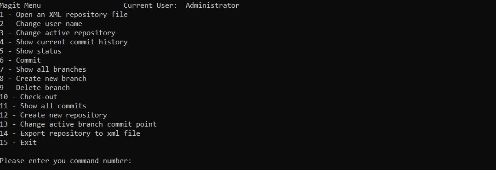
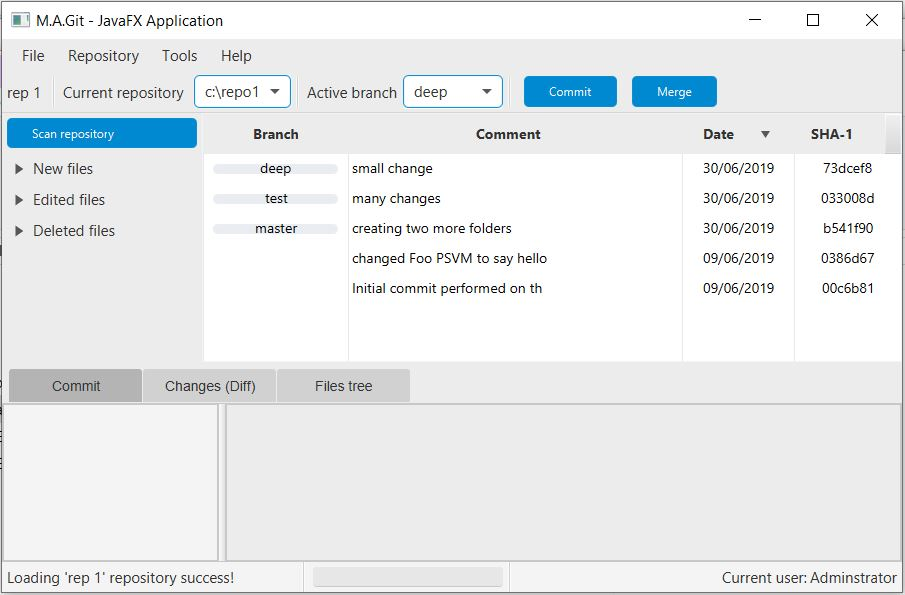
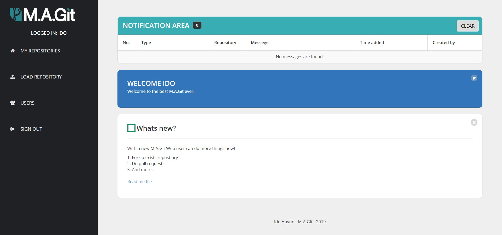

# Java Exercises
Part of Java Course in MTA

# Reflection:
Testing reflection abilities of Java.

# M.A.Git

A three kind applications:
## Console application

### Basic working with M.A.Git
User can create and manage repository, load and export repository via XML files.
Also, create branches, watch and make commits.
## Window application (JavaFX)

### Advanced M.A.Git
A lot of new features:
Manage repository and watch all commits and file tree of each of them.
Show current working copy status, create branches and reset there point.
Watch all commits in a tree view.
Also, user can now clone a repository and with this option for the cloned repository 
the user can push, pull and merge changes between those two repositories.
[README](JAVAFX_README.pdf)
## Web application

### Super cool M.A.Git
Now M.A.Git is a huge website! now each person can create a user to himself,
upload a repository and do all he wants via the web interface.
Merge, pull and push (branches) changes from forked repository and new feature is 
Pull requests.
Also, for push branch, pull request and fork repository the owners will get a notification
about those actions.
[README](WEB_README.pdf)
